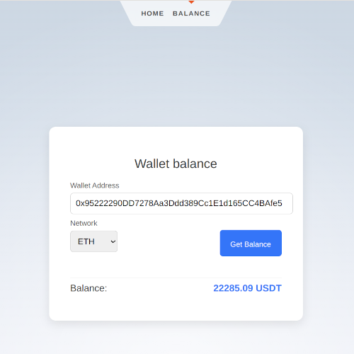

# EVM-Compatible Wallet Balance Checker


A simple, fullstack web application that helps users check the balances of their EVM-compatible wallets across various blockchain networks in usdt equivalent.



This project was created to experiment with modern backend and frontend frameworks.

## 🛠 Technologies Used
- **Frontend**: Svelte.js — a fast, modern framework for building user interfaces.
- **Backend**: Litestar — a flexible backend framework for fast APIs.
- **Package Manager**: UV — lightweight package manager for dependencies.
- **Docker**: Easily deployable with Docker.

## 🚀 Getting Started

### Prerequisites
- Docker installed on your machine.
- Node.js and npm for local development.

### Installation
1. **Clone the repository**

```sh
git clone https://github.com/balancy/evm_balances.git
```

2. **Navigate to the project directory**

```sh
cd evm_balances
```

3. **Build and run the Docker containers**

```sh
make
```

4. **Visit the app**

Open http://localhost:5173/ in your browser


### Run on server
Define the file with environment variables

1. **Clone the repository**

```sh
git clone https://github.com/balancy/evm_balances.git
```

2. **Navigate to the project directory**

```sh
cd evm_balances
```

3. **Define env variables**

Copy file
```sh
cp .env.example .env
```

Define your host inside `.env`
- HOST=your_hostname

4. **Run Docker containers**

```sh
make prod
```
